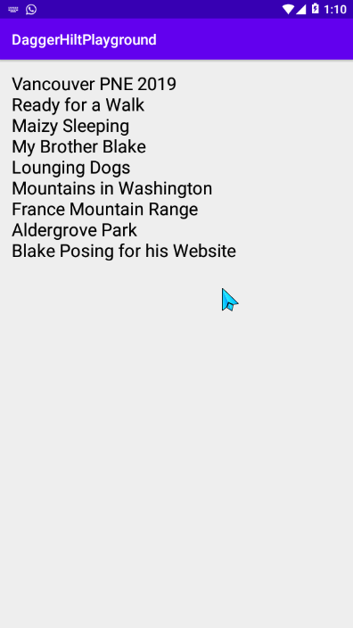

# Dagger-hilt dependency injection.

Hilt is a dependency injection library for Android that reduces the boilerplate of doing manual dependency injection in your project. 
Doing manual dependency injection requires you to construct every class and its dependencies by hand, and to use containers to reuse and manage dependencies.

Hilt provides a standard way to use DI in your application by providing containers for every Android class in your project and managing their lifecycles automatically. 
Hilt is built on top of the popular DI library Dagger to benefit from the compile-time correctness, runtime performance, scalability, and Android Studio support that Dagger provides. For more information, [see Hilt and Dagger](https://developer.android.com/training/dependency-injection/hilt-android#hilt-and-dagger).

## Features 
- Hilt
- Retrofit2
- Room
- Repository pattern
- MVVM / MVI

[Data Source](https://open-api.xyz/) 

### Screenshot 

#### License
This project is licensed under the Apache License 2.0 - See: http://www.apache.org/licenses/LICENSE-2.0.txt